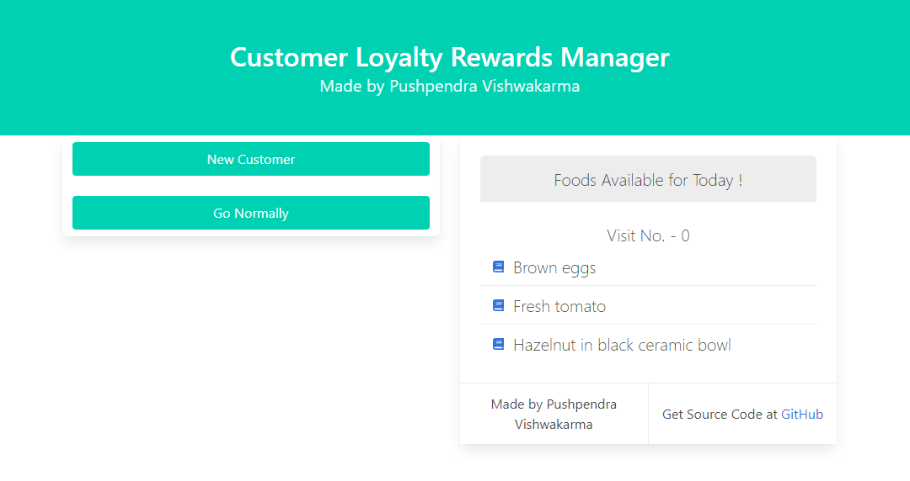
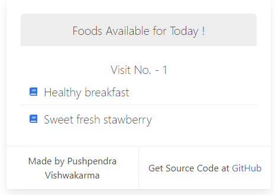
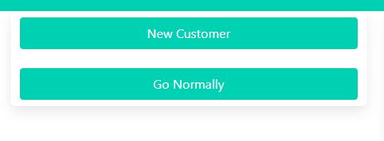

# Front End Assignment Implementation !
  - Our Front End Application uses localstorage for State Management, as this was Assignment, for further Development we can use Redux also
  - Used Bulma CSS Framework for Designing the Application
  - You can Create Rules as on Which Visit Which Offerings will be served
  - And it maintains the state of customer that on which visit what offerings will customer can have for free
  - As in Create rules on Navigation bar 2nd Option You Can Set Your Own, and Fix The visit number with Offerings.

<!-- ## Our Same Backend Application is hosted on Heroku app
- API requests are Accepted at this Site [https://backendassign.herokuapp.com/](https://backendassign.herokuapp.com/)
- To See API Docs For This Backend Codes [Click Here](https://backendassign.herokuapp.com/api-docs/)
``` As Heroku requires Premium Services We Recommend you to Download Redis-Server in Your Computer and test Our Server at Local only``` -->

### Installation and Runnning our Service

Our Backend APIs requires [Node.js](https://nodejs.org/) to run.
##### Initially Download our Git Repository
```sh
$ cd Front-Developers-Assignment2020
$ npm install
$ npm start
```
### Some Snippets






**Made by Pushpendra Vishwakarma !**

